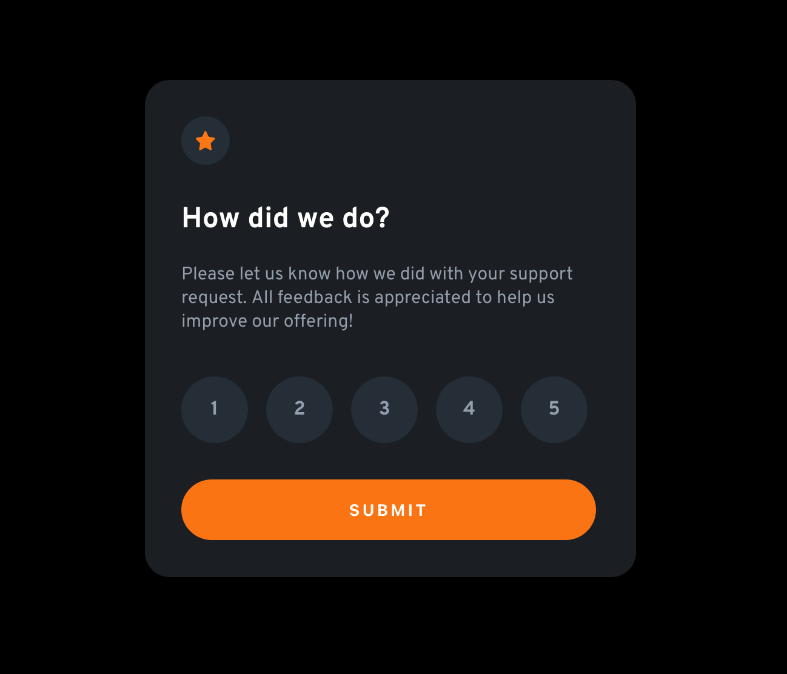
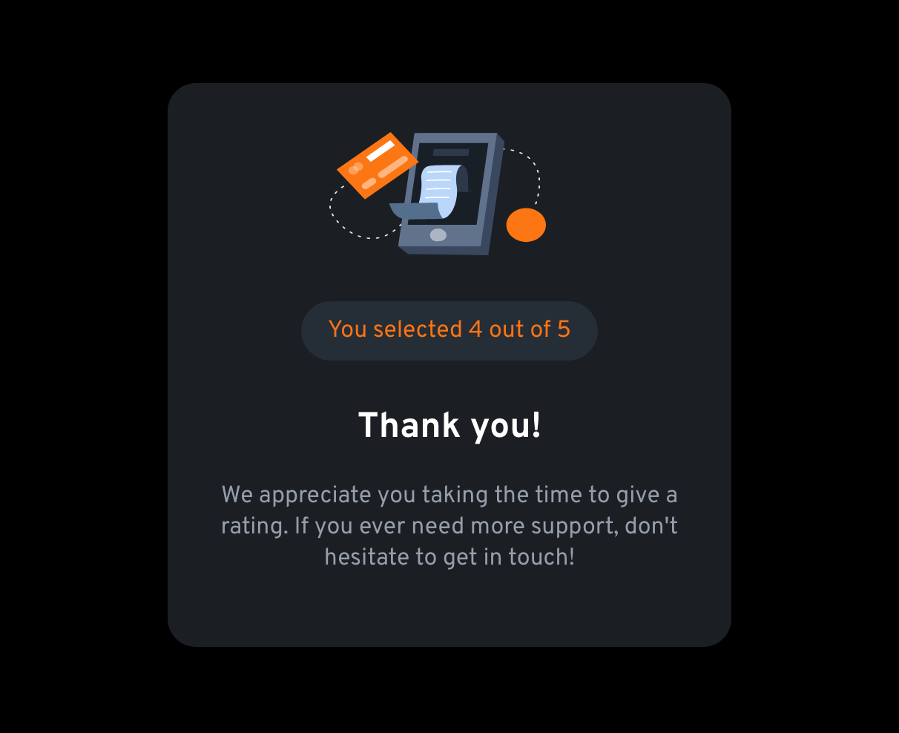

# Frontend Mentor - Interactive rating component solution

This is a solution to the [Interactive rating component challenge on Frontend Mentor](https://www.frontendmentor.io/challenges/interactive-rating-component-koxpeBUmI). 
## Table of contents

- [Frontend Mentor - Interactive rating component solution](#frontend-mentor---interactive-rating-component-solution)
  - [Table of contents](#table-of-contents)
  - [Overview](#overview)
    - [Screenshot](#screenshot)
    - [Links](#links)
  - [My process](#my-process)
    - [Built with](#built-with)
    - [What I learned](#what-i-learned)
    - [Continued development](#continued-development)
  - [Author](#author)
## Overview
This challenge requires the developer to build a feedback form such that users would be able to:

- View the optimal layout for the app depending on their device's screen size
- See hover states for all interactive elements on the page
- Select and submit a number rating
- See the "Thank you" card state after submitting a rating

### Screenshot




### Links

- [Code](https://github.com/francisldn/FOM-feedback-form)
- [Frontend](https://frontendmentor-feedback-form-d0wmazgqk-francisldn.vercel.app)

## My process
For this project, I created 2 pages:
* Ratings consists of 
  * star logo
  * text
  * array of ratings from 1 to 5 which changes colour on hover
  * Submit button which changes colour on hover and will redirect to the Thank-you page
    * if user does not select any rating before submitting, there will be an warning message which requires user to do so
* Thank-you consists of
  * card-machine image
  * text to display the rating selected by the user and other messages
    * rating is persisted through url parameter
### Built with

- CSS custom properties
- Flexbox
- [React](https://reactjs.org/)
- [React Router] (https://v5.reactrouter.com/web/guides/quick-start)
- [Material UI] (https://v4.mui.com/) - for display alert message

### What I learned

To see how you can add code snippets, see below:

* ``createRef`` to extract HTML elements and change CSS styles
  * using CSS custom properties to update HTML element's CSS styles
```
import {createRef} from 'react';

// create an instance of dom for extracting HTML element
const ratingRef = createRef();

// extract the length of an HTML list
const n = ratingRef.current.children.length

// loop through HTML list element and change CSS styles
for (let i=0; i<n; i++) {
    if (i === selectedRating-1) {
        // update CSS styles using CSS custom properties 
        ratingRef.current.children[i].style.cssText += "background-color:var(--orange-color); color:white"
    } else {
        ratingRef.current.children[i].style.cssText += "background-color:var(--darkblue-color); color:var(--lightgrey-color)"
    }
}

```
* ``useParams`` to store and persist state through URL parameters
```
import {useParams} from 'react-router-dom';
// extract ratings from URL parameters
const {ratings} = useParams();

```
* ``useHistory`` to route webpage
```
import {useHistory} from 'react-router-dom';

let history = useHistory();

const handleSubmit = () => {
  // route to another page
  history.push("/thankyou/"+ratings)
]

```
* Create an Alert reusable functional component to display error message
  * use ``MuiAlert`` to display warning/error message
```
  <Snackbar open={alert.open} autoHideDuration={2000} onClose={handleClose}>
    <MuiAlert onClose={handleClose} elevation={10} variant="filled" severity={alert.type}>
        {alert.message}
    </MuiAlert>
  </Snackbar>

```
### Continued development
* Other ways/techniques to persist states when performing routing

## Author

- [Github](https://github.com/francisldn)
- Frontend Mentor - [@francisldn](https://www.frontendmentor.io/profile/francisldn)
- Twitter - [@francisldn22](https://www.twitter.com/yourusername)

